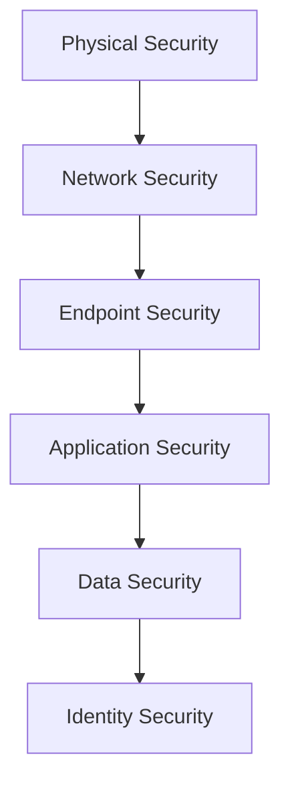

# What is Cybersecurity?

## Table of Contents

- [Introduction](#introduction)
- [What is Cybersecurity?](#what-is-cybersecurity)
- [Why is Cybersecurity Important?](#why-is-cybersecurity-important)
- [Objectives of Cybersecurity](#objectives-of-cybersecurity)
- [How Cybersecurity Works](#how-cybersecurity-works)
- [The Three Pillars: People, Process, and Technology](#the-three-pillars-people-process-and-technology)
- [Cybersecurity in Everyday Life](#cybersecurity-in-everyday-life)
- [Who Needs Cybersecurity?](#who-needs-cybersecurity)
- [Common Cyber Threats](#common-cyber-threats)
- [Layers of Cybersecurity](#layers-of-cybersecurity)
- [Real-World Example](#real-world-example)
- [Practical Example](#practical-example)
- [Common Misconceptions](#common-misconceptions)
- [Best Practices](#best-practices)
- [Key Takeaways](#key-takeaways)
- [Interview Questions](#interview-questions)
- [Summary](#summary)
- [Next Topic](#next-topic)

---

# Introduction

Every day, billions of people use computers, smartphones, websites, online banking, social media, cloud storage, and digital payment systems.

All these technologies store valuable information such as:

- Personal photos
- Bank account details
- Passwords
- Medical records
- Business documents
- Government data

If this information falls into the wrong hands, it can lead to financial loss, identity theft, privacy violations, or disruption of critical services.

Cybersecurity exists to protect these digital assets.

---

# What is Cybersecurity?

**Cybersecurity** is the practice of protecting computers, networks, applications, devices, and data from unauthorized access, cyberattacks, damage, or theft.

It combines technology, policies, processes, and people to reduce cyber risks and keep information secure.

Simply put:

> **Cybersecurity is the practice of protecting everything that exists in the digital world.**

---

# Why is Cybersecurity Important?

Imagine leaving your house unlocked while you are away.

Anyone could:

- Steal your belongings
- Damage your property
- Access private information

The same idea applies to computers and networks.

Without cybersecurity:

- Hackers can steal passwords.
- Malware can destroy files.
- Attackers can encrypt your data and demand money.
- Businesses can lose millions.
- Governments can lose sensitive information.

Cybersecurity helps prevent these situations.

---

# Objectives of Cybersecurity

Cybersecurity aims to:

- Protect confidential information
- Prevent unauthorized access
- Maintain data accuracy
- Keep systems available
- Detect attacks quickly
- Recover from incidents
- Reduce business risk

---

# How Cybersecurity Works

Cybersecurity uses multiple layers of protection.

```text
Internet
    │
    ▼
Firewall
    │
    ▼
Intrusion Detection System
    │
    ▼
Secure Network
    │
    ▼
Servers
    │
    ▼
Applications
    │
    ▼
Users
```

Instead of relying on a single security measure, organizations combine many security controls.

This approach is called **Defense in Depth**.

---

# The Three Pillars: People, Process, and Technology

Cybersecurity is not only about software.

It depends on three equally important components.

## 1. People

People are often the weakest link in security.

Examples:

- Weak passwords
- Clicking phishing emails
- Sharing confidential information
- Installing unknown software

Security awareness training helps reduce these risks.

---

## 2. Process

Processes define how security should be managed.

Examples include:

- Password policies
- Backup procedures
- Incident response plans
- Access control policies

Processes ensure consistency.

---

## 3. Technology

Technology provides tools to protect systems.

Examples:

- Firewalls
- Antivirus
- SIEM
- IDS/IPS
- VPN
- MFA
- Encryption

Technology alone cannot stop every attack.

---

# Cybersecurity in Everyday Life

Most people use cybersecurity without realizing it.

Examples include:

- Unlocking your phone with a fingerprint
- Logging into Gmail
- Shopping online
- Using online banking
- Connecting to secure Wi-Fi
- Receiving OTP verification
- Using password managers

These are all cybersecurity measures.

---

# Who Needs Cybersecurity?

Everyone.

## Individuals

Protect:

- Photos
- Emails
- Social media
- Banking accounts

---

## Businesses

Protect:

- Customer data
- Financial records
- Intellectual property

---

## Governments

Protect:

- National security
- Military systems
- Citizen information
- Critical infrastructure

---

## Educational Institutions

Protect:

- Student records
- Research data
- Online learning systems

---

# Common Cyber Threats

Some of the most common threats include:

| Threat | Description |
|---------|-------------|
| Malware | Malicious software |
| Virus | Infects files |
| Worm | Spreads automatically |
| Trojan | Disguised as legitimate software |
| Ransomware | Encrypts files for ransom |
| Spyware | Steals information |
| Phishing | Fake emails to steal credentials |
| DDoS | Makes services unavailable |
| Password Attacks | Guessing or stealing passwords |
| Insider Threat | Trusted users abusing access |

---

# Layers of Cybersecurity

Security is implemented in layers.



Each layer protects against different types of attacks.

---

# Real-World Example

Suppose a company has:

- 500 employees
- Online payment system
- Customer database
- Internal servers

An attacker sends a phishing email.

An employee clicks the malicious link.

Without cybersecurity:

- Credentials are stolen.
- Attackers access the network.
- Customer information is leaked.

With cybersecurity:

- Email filtering blocks the message.
- Multi-Factor Authentication prevents account takeover.
- Endpoint protection detects malware.
- Security team investigates the incident.

The attack is stopped before major damage occurs.

---

# Practical Example

Imagine your smartphone.

Security features include:

- Screen lock
- Face recognition
- Fingerprint authentication
- App permissions
- Automatic updates
- Encrypted storage
- Find My Device

Together, these features provide cybersecurity for your phone.

---

# Common Misconceptions

## "Cybersecurity is only for hackers."

False.

Cybersecurity protects everyone.

---

## "Antivirus is enough."

False.

Modern attacks bypass antivirus.

Multiple security controls are required.

---

## "Small businesses are not targeted."

False.

Small businesses are frequently attacked because they often have weaker security.

---

## "Strong passwords alone are enough."

False.

Use Multi-Factor Authentication whenever possible.

---

# Best Practices

- Use strong passwords.
- Enable Multi-Factor Authentication.
- Update software regularly.
- Backup important data.
- Avoid suspicious links.
- Use trusted software.
- Encrypt sensitive information.
- Lock your devices.
- Learn to identify phishing emails.
- Keep operating systems updated.

---

# Key Takeaways

- Cybersecurity protects digital systems and information.
- Everyone needs cybersecurity.
- Security is a combination of people, processes, and technology.
- Multiple security layers provide better protection.
- Prevention is cheaper than recovering from an attack.

---

# Interview Questions

### What is cybersecurity?

Cybersecurity is the practice of protecting systems, networks, devices, applications, and data from cyber threats and unauthorized access.

---

### Why is cybersecurity important?

It protects confidentiality, integrity, availability, privacy, and business continuity.

---

### What are the three pillars of cybersecurity?

- People
- Process
- Technology

---

### What is Defense in Depth?

Using multiple layers of security controls instead of relying on a single security solution.

---

### Who needs cybersecurity?

Everyone, including individuals, businesses, governments, educational institutions, and healthcare organizations.

---

# Summary

Cybersecurity is the foundation of the digital world.

It protects information, systems, and users from cyber threats by combining people, processes, and technology. As technology becomes more integrated into everyday life, cybersecurity becomes increasingly important for individuals and organizations alike.

Understanding these basics prepares you for more advanced topics such as networking, operating systems, web security, penetration testing, cloud security, and incident response.

---

# Next Topic

➡️ **Cybersecurity-Domains.md**

In the next chapter, you'll learn about the major domains of cybersecurity, including Network Security, Application Security, Cloud Security, Mobile Security, Digital Forensics, Incident Response, Governance, Risk and Compliance (GRC), and more.
